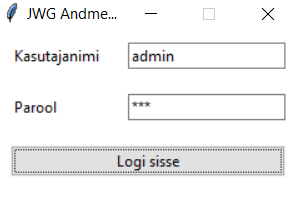
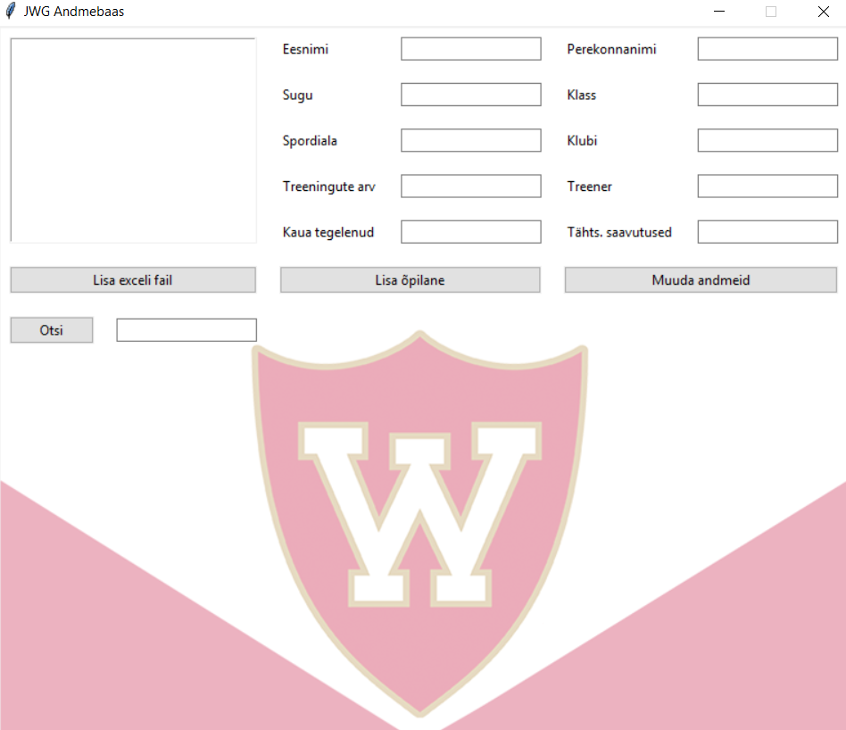

# JWG-Database
A database for school project I had been working on. The database gives an ability to insert premade Excel table and read data from it. It was made for PE teachers to gain additional information about students and later have the ability to choose them to represent school in different competitions.

I have also uploaded a .exe file if you only want to see the program in action. Also, make sure all the files are in the same folder before executing the .exe file!

Marcus Murumäe  
